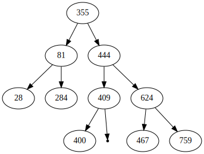

# BST
Implementation of some Binary Search Trees in C


## Trees
The following BST are implemented
 - AVL
 - Red–black tree (in progress)

The implementation is chosen at the compile time by specifying a MACRO. Check the `CMakeLists.txt` file.    
**By default AVL is chosen.** 

## Collection
There is generic collection defined. The collection will contain some **Element** which is just a `typedef int`.

## Tree drawing
### ASCII
You can draw the tree int ASCII like that `show_collection_in_ascii` :
```
        355
        / \
       /   \
      /     \
     /       \
    /         \
   81         444
  / \         / \
 /   \       /   \
28   284    /     \
          409     624
          /       / \
        400      /   \
               467   759
```

### GraphViz
You can also draw with Graphviz. The `create_dot_file_for_collection` create a dot file which is can be interpreted by the
`dot` command. Example :  
```bash
# Create an SVG for the tree
dot -Tsvg generatedFile > tree_in_svg.svg
```
